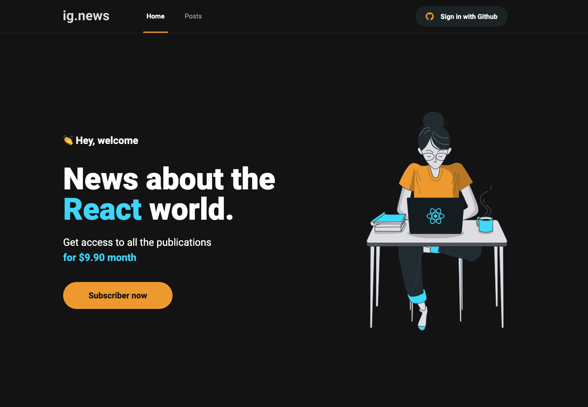

<h1 align="center">
	Plataforma de publicação de conteúdo
</h1>

<p align="center">
  

  <a href="https://www.linkedin.com/in/luanyata/">
    
  </a>

  

  <a href="https://github.com/luanyata/IgNews/stargazers">
    
  </a>
</p>

## Sobre:

Plataforma para publicação de conteúdo pago

## Tecnologias:

- React
- Typescript
- Next
- Stripe
- FaunaDB
- Github Authentication
- Prismic
- Axios

## Stripe:

---

### **_Instalar Stripe-CLI:_**

Instalar de acordo com o SO: https://stripe.com/docs/stripe-cli

### **Rodar Stripe Interceptopr Webhook localmente:**

```sh
stripe listen --forward-to localhost:3000/api/webhooks
```
